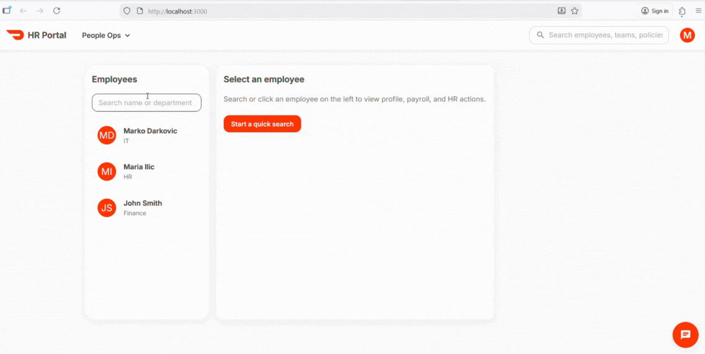

# Demo

Live Demo: TODO

API: TODO

# Overview

HR Portal is a polished, production-grade internal tool inspired by the HR platforms used at modern tech companies. It provides a fast and intuitive interface for:

📒 Employee Directory

🧾 Employee Details (Profile, Payroll & Notes)

💬 AskHR Chatbot (AI-powered Q&A)

🧭 Responsive, modern UI with custom theme

## Tech Stack

Frontend

    - React (with modern JSX transform)

    - Material UI (MUI v5)

    - React Hooks (useState, useEffect)

Backend

    - Node.js

    - Express.js

    - CORS

### Folder Structure

project/

  client/         # React frontend

    src/

      components/

      config.js   # central API URL config

      theme.js

      ...     
  server/         # Node/Express backend

    index.js

    employees.json

    chat.js

  .gitignore

  README.md

### Setup Instructions

1. Clone repo

    git clone https://github.com/YOUR_USERNAME/hr-portal.git

    cd hr-portal

2. Client setup http://localhost:3000

    cd client

    npm install

    npm start

3. Server setup http://localhost:5000
    cd server

    npm install

    npm start

